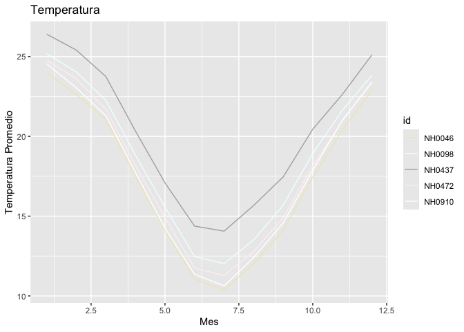

<!-- README.md is generated from README.Rmd. Please edit that file -->

# PaqueteMeteorologia

<!-- badges: start -->

[](https://lifecycle.r-lib.org/articles/stages.html#experimental)
[](https://github.com/marcosziadi/PaqueteMeteorologia/actions/workflows/R-CMD-check.yaml)

<!-- badges: end -->

El objetivo del PaqueteMeteorologia es el analisis de dataset de datos
de estaciones meteorologicas.

## Instalacion

Puedes instalar el PaqueteMeteorologia desde
[GitHub](https://github.com/) con:

``` r
# install.packages("pak")
pak::pak("marcosziadi/PaqueteMeteorologia")
```

## Ejemplo de uso del paquete:

Este es un ejemplo basico de como puedes solucionar un problema comun:

``` r
library(PaqueteMeteorologia)
## basic example code
```

``` r
celsius_to_fahrenheit(3)
#> [1] 37.4
```

``` r
grafico_temperatura_mensual(estaciones_merged)
```



``` r
tabla_resumen_temperatura(estaciones_merged)
#> # A tibble: 5 × 4
#>   id     min_temp max_temp mean_temp
#>   <chr>     <dbl>    <dbl>     <dbl>
#> 1 NH0046    -0.25     34.6      17.3
#> 2 NH0098   -17.4      37.4      18.6
#> 3 NH0437     2.1      36.3      20.2
#> 4 NH0472     0.55     34.8      18.0
#> 5 NH0910     0        35.2      17.7
```
